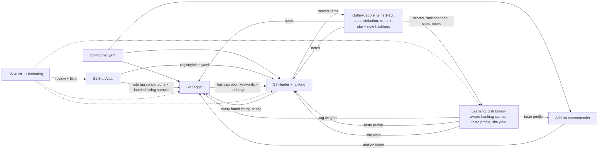

# Roadmap

This roadmap covers the build order, the session plan, the run loop and the shared contracts for the Costume shopping system.

Written in Session 0 on 2026-09-29. Each later session updates the section for its own system when it hands off.

## 1. Goal

The goal is a resale-shopping system that finds deep-cut items across a very wide range of sites. Tags generated from an item's **text and photo** steer the search. The system **learns the vibe and taste of the costume from ratings**, so every run searches and ranks better than the last.

Its first real job is the costume brief in `config/brief.yaml`:

| | |
|---|---|
| Character | Patrick Bateman, one-time costume |
| Already owned | Suit, tie |
| Need | Briefcase, fake axe, fake blood |
| Also wanted | Recommendations for add-ons that would make the costume look tough |
| Output | A growing gallery of rated items. **The user puts the costume together later; the system never assembles a kit.** |
| Budget | **$75 total, shipping and tax included** |
| Briefcase | Must look like a regular full-size briefcase or attaché, not a mini. Must hold 12 oz cans or longneck bottles plus 1–2 bags of ice. |
| Buy by | **2026-10-15** (the event is 2026-10-31) |

### Two phases

1. **Build (S1–S5).** Each system gets one full session whose only job is to build it.
2. **Run (20–30 full runs).** The finished system runs end to end 20–30 times before the buy-by date. Each run adds new items to the gallery, the user rates them, and the system learns from those ratings. §6 describes the loop.

## 2. The systems

| ID | Session | System | Job | What it must learn across runs |
|---|---|---|---|---|
| A | S1 | **Site Atlas** | Find and profile a massive, deep list of shopping sites. Used, resale, vintage, auction and estate sites come first, going far beyond Etsy, Depop and eBay. | Which sites actually produce well-rated items (per-site yield). |
| B | S2 | **Tagger** | Take an item (text and/or photo) and produce a generous set of hashtags and keywords that find it and things like it. Includes site-specific variants. Runs on brief items **and on every listing the Hunter finds**. | Which hashtags find and describe well-rated items. It learns this from 1–10 item scores plus the user's hashtag stars and notes, read against their distributions. It keeps the winners, drops the duds and keeps exploring new tags. |
| C | S3 | **Hunter** | Search the Atlas with keywords and hashtags from the **hashtag pool**. Run the Tagger on every listing found, add the best new hashtags to the pool, and follow them to find new things. Collect, normalize, filter against the brief, dedupe and **rank** the items. | How to rank for the user's taste and the costume's vibe, beyond price and fit. It learns from scores, the user's manual ranking changes and notes, and it reads the score and star distributions. |
| D | S4 | **Integration** | Combine A, B and C into one run loop. Build the **gallery** that collects items for the user to rate, re-rank and annotate. Also build **hashtag stars and notes**, a **hashtag popularity board**, the **taste profile**, and the **add-on recommender**. | Everything above. D is where the learning happens. |
| E | S5 | **Audit & Hardening** | Double-check the whole system, look for holes, fix the worst ones and improve the rest. It also proves the learning loop actually improves results. | Nothing; E verifies the rest. |

The Tagger is the foundation: its tags curate and guide the Hunter. Ranking and hashtag creation are the two places that have to be most advanced, because they are what lets the system get better with each run.

## 3. How the pieces connect

Items G, L and R are built in S4.

## 4. Build order

### Options considered

1. **A → B → C** (the order the user proposed): sites, then tags, then shopping.
2. **B → A → C**: tags first, because everything else depends on them.
3. **Thin C first**: a rough end-to-end shopper, then deepen each part.

| Criterion | A → B → C | B → A → C | Thin C first |
|---|---|---|---|
| Matches dependencies | Yes. A needs nothing upstream. | Partly. B can't measure itself without sites to search. | No. It builds on parts that don't exist yet. |
| Retires the biggest risk early | Yes. It finds out early which sites can actually be searched from here. | No. Access risk surfaces late, in S3. | Partly, but only for a handful of sites. |
| Gives B real evaluation data | Yes. A can harvest real listings (photo, seller title, seller tags) as ground truth. | No. B would have to invent an eval set and probably redo it. | No. |
| Time to first result | Slower | Slower | Fastest |
| Rework risk | Low | Medium | High. It locks in naive keywords and a few obvious sites, which is what A and B exist to beat. |

### Recommendation: A → B → C → D → E

The order the user proposed is right, with two additions to S1:

- **S1 also records how each site can be searched from this environment.** Most retailer hosts are blocked from the container (§11). If many sites can only be reached through a search-engine index, or not at all, the Hunter's design changes. That is better learned in S1 than discovered in S3.
- **S1 also harvests a labeled listing sample** (photo, seller title, seller tags or attributes, site) across the needed item types. That becomes S2's ground truth. The best test of a tag is **downstream yield**: does it find relevant listings? Real listings are what make that measurable.

**Chaining rule:** each session ends by writing the next session's kickoff prompt in `docs/sessions/`, based on what it actually built and learned.

**If time gets tight:** S2's tool-and-prior-art sweep doesn't depend on S1's output, so it can start while S1 is still building.

## 5. Method Discovery: every session starts here

Every session, S1 through S5, is a full session of its own whose job is to build its system. Each one **opens with a workflow that works out the best way to build its part before building it.** Each session designs that workflow itself. The minimum bar:

- **Frame.** Inputs, outputs, constraints, definition of done and a timebox.
- **Sweep.** Look at tools, services, APIs, MCP servers and connectors, models and datasets, and at prior art: how other people have solved this. Check whether each option is actually reachable from this environment.
- **Ask and suggest.** Bring the user in before any design is locked:
  - **Ask 5–10 questions** about how this system should work. Make them specific and informed by the sweep, each with a sensible default, so the user can answer fast or accept the defaults.
  - **Suggest 1–5 things to implement** that would make the system better. Each gets a one-line reason and a rough cost in time.
  - **Wait for the answers.** Use them to shape the candidates and the decision. If the user doesn't answer, go with the stated defaults and say so.
  - **Record it.** Keep the questions, the answers, and which suggestions were accepted or declined.
- **Candidates.** Come up with at least two genuinely different methods, one of them a cheap baseline.
- **Bake-off.** Run the candidates on the same inputs. Write the scoring rule down *before* looking at results.
- **Challenge.** Actively look for holes in the winning method.
- **Decide.** Write a decision record in `docs/decisions/`.
- **Build, verify, hand off.**

Keep the working record in `research/<session>/method-discovery.md` (template: `docs/templates/method-discovery.md`).

Every system is built to be **run 20–30 times**. Design for repeat runs from the start: run logs, stable IDs, idempotent steps, and a cost per run that fits the calendar.

## 6. The run loop (20–30 runs)

Each run goes end to end, adds new items to the gallery, and leaves the system smarter than it found it. **The system never assembles a costume.** It keeps a growing, scored collection, and the user puts the costume together from it later.

1. **Ideas.** The core items from the brief, plus add-on ideas from the recommender, plus the user's top-scored items (to find more like them).
2. **Tags.** The Tagger generates a **generous set of hashtags and keywords** per idea from text and photos. These go into the **hashtag pool**: every hashtag and keyword the system knows, with its stats.
3. **Hunt.** The Hunter searches the Atlas with keywords and hashtags drawn from the pool. It weights them by learned score, the user's stars and notes, and scarcity (see step 9), and it always keeps a share of new tags in play to explore. It favours sites with proven yield, filters by the brief, and reads the user's notes.
4. **Tag the finds.** The Hunter runs the Tagger on **every listing it finds**, using both the photo and the text. That has three results:
   - Each listing records all the hashtags that *describe* it, not just the one that found it. Scores therefore teach the system about every relevant hashtag.
   - The strongest new hashtags join the pool.
   - Seller tags on the listing are mined as candidate hashtags.
5. **Follow the new hashtags.** The best new keywords and hashtags from step 4 drive follow-up searches in the same run, which find things the original ideas would never have reached. A per-run budget caps this.
6. **Rank.** The Hunter ranks **every item** by a blend of:
   - fit to the brief
   - landed price
   - taste and vibe match
   - deep-cut value
   - freshness
   - the user's notes and manual ranking changes

   Each item's score shows its parts.
7. **Add to gallery.** New items join the collection. Each item shows its picture, a link, its landed price, its rank, and its hashtags.
8. **User feedback.** Every piece of feedback is quick to give and easy to change later:

   | What | How | Required? |
   |---|---|---|
   | **Score every item** | **1–10**, changeable any time | Yes. Item scores are the main learning signal. |
   | **See the score distribution** | A chart of how many items sit at each score from 1 to 10, overall and per item type (briefcase, axe, blood, add-ons), with the item being scored marked on it | Always visible while scoring, so the user can judge consistently (e.g. "I've only given two 9s; is this really a 9?") |
   | **Change the ranking** | Drag to reorder, pin to top, bury, or adjust the ranking-factor sliders (price vs taste vs fit vs rarity) | Optional, and it takes effect immediately |
   | **Star a hashtag** | ★, ★★ or ★★★ to boost it harder, or mute it | Optional. Hashtags never need to be rated one by one. |
   | **Add a note to an item or hashtag** | Free text, e.g. "more like this but darker leather" or "skip aluminum cases" | Optional. The Tagger and Hunter read notes on every run. |

9. **Learn, reading the distributions.** The shopper doesn't take scores and stars at face value; it reads them against their distributions:
   - **Item scores are relative.** A score counts by where it sits in the user's own distribution. If the user rarely goes above 7, a 7 is top-tier. Scores are also compared within each item type.
   - **Hashtag stars are weighted by scarcity.** If only one hashtag has ★★★, that hashtag is a very strong, very valuable signal and gets searched hard. If twenty have ★★★, each counts for less. Mutes are respected absolutely.

   From those signals it updates:
   - **Hashtag scores.** Learned from the scores of the items each hashtag *describes*, with the scarcity-weighted stars and mutes on top. Tracked per hashtag: uses, items found and described, the distribution of those items' scores, and trend across runs.
   - **Taste profile.** A learned model of the costume's vibe from high-scored and low-scored items, covering images as well as text, plus the user's notes. It includes a short plain-English "vibe summary" that is refreshed every run.
   - **Ranking model.** Learns from scores and from the user's manual reordering, pins and slider settings.
   - **Site yield.** High-scored items per site.
   - **Recommender state.** Which add-on ideas land.
10. **Report.** A run log with metrics, compared against earlier runs.

**The hashtag popularity board** shows which hashtags are popular. It ranks them:
- by the scores of the items they describe;
- by the user's stars;
- by how many high-scored items they find;
- by trend (rising or falling).

The board also shows the **star distribution**, for example "1 hashtag at ★★★, 6 at ★★, 24 at ★". That makes scarcity visible to both the user and the shopper. The board is what makes the search better each run, and the user can steer it with stars, mutes and notes.

**The add-on recommender** suggests items that would make the costume look tough, such as iconic details from the film and accessories that fit the learned vibe. It hunts for them and adds them to the gallery as ordinary items with their landed price. The user decides what goes in the costume.

**Budget helper (user-controlled).** The user can mark items as picks. The gallery then shows a running total of their landed prices against the $75. The system never picks for the user.

**Run metrics** should trend upward across runs. S5 checks that they actually do:
- the score percentile of each run's top 10 items
- new high-scored items per run
- hashtag hit rate
- the share of good finds that came from follow-up hashtags (step 5)
- the share of finds from deep-cut sites
- cost per run

**Open for Method Discovery:** how the taste profile, hashtag scores and ranking actually learn. The options include:
- weighted tag priors
- percentile or z-score normalization of item scores
- scarcity weighting of stars
- image embeddings of high-scored items
- learning to rank from scores and manual reorders
- bandits for choosing tags and sites
- turning notes into constraints with Claude
- using Claude as a judge of the vibe summary

These are hypotheses for S2, S3 and S4 to test, not decisions.

## 7. Agents

Sessions can and should create their own agents (in `.claude/agents/`) whenever doing so would make the system better.

## 8. Session briefs

### S1: Site Atlas (Sep 30)

- **Job:** build a massive, deep list of places to shop. Used, resale, vintage, auction and estate sites come first. Go well past the obvious (Etsy, Depop, eBay) into niche, regional, app-first, auction, estate-sale, liquidation, international-proxy and specialty sites.
- **Starter segments** (a floor, not a limit): general marketplaces, fashion resale, vintage and antique, auctions and estate sales, online thrift, liquidation and returns, local classifieds, international and proxy buying, costume, prop and Halloween, luggage and office, deal aggregators.
- **Questions for Method Discovery:**
  - How do people find obscure resale sites?
  - Which directories, lists and communities catalogue marketplaces?
  - How can we tell a live site from a dead one?
  - How can searchability be tested at scale without breaking anyone's terms?
  - How should the list keep growing, and track per-site yield, across 20–30 runs?
- **Outputs:**
  - `registry/sites.yaml`, validated against `schemas/site.schema.json` (S1 owns this schema and may revise it).
  - An access result for every site.
  - Tag conventions per site.
  - The labeled listing sample for S2.
  - A rerunnable workflow, so the Atlas can be refreshed later.
  - A decision record, a handoff note and the S2 kickoff.
- **Done when:**
  - At least 150 live sites are in the registry (S1 sets the real target).
  - Every site has been probed.
  - The sample covers briefcases, axes and blood, with photos.
  - All tests pass.

### S2: Tagger (Oct 1)

- **Job:** take an item as text, a photo or both, and produce a **generous set** of ranked hashtags and keywords that find it and similar items on resale sites. This includes site-specific forms such as marketplace tags, hashtags and item attributes. It has to use the **picture**, not just the words.
- **Two callers.**
  - Brief items and add-on ideas.
  - **Every listing the Hunter finds.** The Hunter needs this to tag its finds and grow the hashtag pool, so the Tagger must be cheap and fast enough to run on every listing. A tiered approach (a light pass on all listings, a deep pass on promising ones) is one option to test.
- **It must be advanced, and it must learn without the user rating every hashtag.**
  - **Stable IDs.** Hashtags get stable IDs, so item scores roll up to every hashtag that *describes* an item.
  - **Inputs.** Generation takes learned hashtag scores, the user's ★/★★/★★★ boosts and mutes (weighted by scarcity), and notes on hashtags and items.
  - **Pool upkeep.** It maintains the **hashtag pool**: it favours hashtags with strong stats, retires dead ones, mines new ones from high-scored listings and seller tags, and keeps an exploration share.
- **Hypotheses to test** (not decisions):
  - a multimodal LLM reading the photo directly
  - CLIP-family zero-shot tagging (e.g. FashionCLIP, SigLIP) against a tag vocabulary
  - reverse image search
  - marketplace autocomplete and suggest endpoints
  - mining tags from similar listings
  - hybrids of the above
- **Primary metric:** downstream search yield, meaning how many relevant listings the tags find, including through follow-up searches on newly mined hashtags.
- **Secondary metrics:** agreement with seller tags, deep-cut potential (rare but relevant terms), cost and latency.
- **Outputs:**
  - The `ItemInput`, `TagSet`, `TagStats` and hashtag pool contracts.
  - The tagger tool.
  - Eval results.
  - A decision record, a handoff note and the S3 kickoff.

### S3: Hunter (Oct 2)

- **Job:** search the Atlas broadly with keywords and hashtags from the **hashtag pool**, plus the brief. Collect listings, then:
  - **run the Tagger on every listing found**, add the best new hashtags to the pool, and follow them with more searches in the same run, within a per-run budget;
  - normalize each listing to a **landed price** (item + shipping + tax);
  - filter against the brief (briefcase size, budget, item type);
  - dedupe across sites;
  - rank the results.
- **It must read the distributions, not raw values.**
  - Item scores (1–10) are read relative to the user's own score distribution, overall and per item type.
  - Hashtag stars are weighted by scarcity. A lone ★★★ hashtag is a very valuable signal and gets searched hard.
- **Ranking must be advanced, and easy for the user to change.**
  - **Factors.** It ranks every item by blending fit, landed price, taste and vibe match, deep-cut value and freshness.
  - **Inputs.** It takes the taste profile, site yield, the user's notes and the user's manual ranking changes (reorders, pins, factor sliders).
  - **Learning.** It improves as ratings come in, and it starts sensibly before any ratings exist.
  - **Explainable.** Every item's score shows its parts, so the user can see why it ranked where it did and adjust it.
- **Questions for Method Discovery:**
  - What's the best way to query hundreds of sites that each have a different access method?
  - How do we pull dimensions and shipping out of messy listings?
  - Which ranking approach learns fastest from a few dozen 1–10 scores and manual reorders?
  - How should scores and stars be normalized against their distributions (percentiles, z-scores, scarcity weights)?
  - How far should follow-up searches on new hashtags go per run before cost outweighs yield?
  - How should free-text notes become ranking and search signals?
  - How should blocked or flaky sites be handled?
- **Outputs:**
  - The `SearchQuery`, `Listing` and `TasteProfile` contracts.
  - The hunter tool and the ranker.
  - A run log format.
  - A decision record, a handoff note and the S4 kickoff.

### S4: Integration (Oct 3)

- **Job:** combine everything into the run loop from §6. It builds:
  - **The gallery.** A growing collection with a picture, link, landed price, rank and hashtags for every item. It is not a finished costume: the user assembles that later.
  - **Item feedback.** A fast **1–10 score** on every item, changeable any time, plus notes on each item.
  - **The score distribution view.** A 1–10 histogram, overall and per item type, that is always visible while scoring and marks the item being scored. It helps the user judge consistently.
  - **Easy ranking changes.** Drag to reorder, pin, bury, and ranking-factor sliders that re-sort the gallery immediately.
  - **Hashtag controls.** ★/★★/★★★ boosts, mute, and notes on any hashtag. Hashtags never have to be rated one by one.
  - **The hashtag popularity board,** including the star distribution (how many hashtags sit at ★, ★★ and ★★★).
  - **The learning step.** After every run it updates hashtag scores, the taste profile, the ranking model and site yield from scores, rank changes, stars and notes, all read against their distributions.
  - **The add-on recommender,** which adds its finds to the gallery as ordinary items.
  - **The budget helper.** Picks marked by the user, with a running total against $75.
  - **One command for a full run,** repeatable 20–30 times.
- **Questions for Method Discovery:**
  - How should images get into the gallery? (§11 explains why this is hard.)
  - Where should ratings, notes and stats live so both the gallery and the pipeline can read and write them?
  - How can scoring every item stay fast across 20–30 runs?
  - How can the system learn well from a small number of ratings?

### S5: Audit & Hardening (Oct 4)

- **Job:** double-check the whole system, look for holes and make it better. That covers:
  - an end-to-end dry run on the real brief;
  - a hostile review of each stage;
  - coverage gaps in the Atlas;
  - failure modes (blocked sites, bad photos, foreign currency, sold-out listings);
  - cost per run against the 20–30-run plan;
  - contract drift.
- **Prove the learning loop works.**
  - Replay simulated or real scores and check that ranking and hashtag choice improve over a no-learning baseline.
  - Check that distribution-aware weighting and follow-up searches actually help.
  - Check it doesn't collapse into a filter bubble.
- Fix the worst issues and leave a ranked backlog for the rest.

## 9. Calendar

| Dates | Work |
|---|---|
| Sep 29 | S0: roadmap and scaffold (this session) |
| Sep 30 | S1: Site Atlas |
| Oct 1 | S2: Tagger |
| Oct 2 | S3: Hunter |
| Oct 3 | S4: Integration |
| Oct 4 | S5: Audit & Hardening |
| Oct 5–14 | **20–30 full runs** (2–3 a day), rating each run's new items in the gallery |
| **Oct 15** | **Buy** |
| Oct 31 | Event |

Each build session is budgeted at one day so the runs get ten days. If a build session slips, the number of runs drops; about 15 runs is the useful minimum.

**Plan B:** if the pipeline isn't producing good finds by Oct 12, the user picks from the best-rated items in the gallery so far, so shipping still arrives in time.

## 10. Contracts

| Contract | Where | Owner | Status |
|---|---|---|---|
| Brief | `config/brief.yaml`, `schemas/brief.schema.json` | S0 | v5 |
| SiteRecord | `schemas/site.schema.json` | S1 | v0 draft |
| ItemInput, TagSet, TagStats, HashtagPool | to be written | S2 | sketch |
| SearchQuery, Listing, TasteProfile | to be written | S3 | sketch |
| ItemScore, ScoreDistribution, TagControl, StarDistribution, Note, RankOverride, RunLog, Recommendation | to be written | S4 | sketch |

Sketches (starting points only; each owner defines the real thing):

- **ItemInput:** `id`, `text`, `images[]`, `category`, `brief_item` (briefcase, axe, blood or add-on), `source` (brief, recommender or a found listing), `source_url`.
- **TagSet:** `item_id`, `tags[]`, plus `per_site` variants and `negative` terms. Each tag has:
  - `tag_id` (stable) and `term`
  - `score`
  - `evidence`: text, image or both
  - `kind`: object, attribute, style, era, brand, material, color or vibe
  - `origin`: generated, mined (from a found listing or its seller tags), follow-up, explore or user
- **TagStats:** `tag_id`, `uses`, `items_found`, `items_described`, `score_distribution` (of the items it describes), `learned_score`, `user_boost` (0–3 stars, or muted), `scarcity_weight`, `trend`, `last_run`.
- **HashtagPool:** every known hashtag and keyword with its TagStats, plus `origin`, `first_seen_run` and `status` (active, exploring, retired or muted).
- **SearchQuery:** `site_id`, `query`, `filters`, `tag_ids[]`, `run_id`, `issued_at`.
- **Listing:** `id`, `site_id`, `url`, `title`, `images[]`, `price`, `shipping`, `landed_price`, `condition`, `dimensions`, `seller_tags[]`, `found_by_tag_ids[]`, `described_by_tag_ids[]` (from running the Tagger on it), `rank_score` with its parts, `run_id`, `found_at`.
- **TasteProfile:** `version`, `vibe_summary`, `tag_weights`, `image_centroids` (high-scored and low-scored), `site_weights`, `rank_factor_weights`, `updated_after_run`.
- **ItemScore:** `listing_id`, `score` (integer 1–10), `scored_at`, `changed_at`. Every item gets one.
- **ScoreDistribution:** `scope` (all, or an item type), `counts` (one count per score 1–10), `mean`, `median`, and the percentile of each score. Recomputed whenever a score changes.
- **TagControl:** `tag_id`, `boost` (1, 2 or 3 stars) or `muted`, `set_at`. Optional; most tags never get one.
- **StarDistribution:** how many hashtags sit at ★, ★★, ★★★ and muted, and the resulting `scarcity_weight` for each level.
- **Note:** `target` (an item or a hashtag), `target_id`, `text`, `created_at`. Read by the Tagger and Hunter on every run.
- **RankOverride:** `listing_id`, `action` (move, pin or bury), `position`, plus the gallery's `factor_weights` (the slider values).
- **RunLog:** `run_id`, `started_at`, `inputs`, `queries`, `listings_added`, `metrics`, `cost`, `errors`.
- **Recommendation:** `id`, `idea`, `why`, `listing_ids[]` (the gallery items found for it), `status` (suggested, liked, dismissed).

Validate any file against a schema with `uv run costume-validate <file> <schema> [--def Name] [--each]`.

## 11. Environment facts (verified 2026-09-29)

- **Retailer hosts are blocked.** The container's egress proxy returns 403 for retailer sites and their image CDNs (tested: amazon.com, `m.media-amazon.com`, `i.ebayimg.com`, `i5.walmartimages.com`, `i.etsystatic.com`).
- **Web access goes through connectors.** Use the **Firecrawl** connector for search and scrape, plus WebSearch/WebFetch. Firecrawl searches also listed Alexandria data providers for eBay, Amazon, Etsy and Target. Whether those providers actually run from here is untested.
- **Package registries work.** PyPI and npm are reachable, as is `storage.googleapis.com`.
- **Artifact pages can't hotlink images.** They block external images, so product photos have to be uploaded to the artifact. The container can only download them if the user adds the image hosts to the environment's allowed domains. The fallback is Firecrawl page screenshots.
- **Python setup.** Python 3.11 and uv are installed. The SessionStart hook runs `uv sync`.

## 12. Risks

| Risk | Impact | Mitigation |
|---|---|---|
| Bot walls and login walls (e.g. DataDome, logged-in-only marketplaces, app-only sellers) | Big sites can't be searched directly | Record them as blockers and never bypass them. Fall back to search-engine indexes, or skip. |
| Blocked hosts and images | No photos in the Tagger or the gallery | Ask the user to allowlist image hosts; use Firecrawl screenshots as the fallback. |
| Cold start (no ratings in the first runs) | Early ranking is generic | Seed from the brief and the vibe of the film. Hashtag stars and notes let the user steer from run 1. |
| Feedback loop narrows too fast | The system stops finding deep cuts | Keep a fixed exploration share of new tags and sites on every run. S5 tests for this. |
| Scoring every item gets tiring over 20–30 runs | Scores get skipped or rushed, and drift over time | Show only each run's new items. Make scoring a single tap or keypress (1–9, 0 for 10). Keep the distribution chart in view so scores stay consistent. Never require hashtag ratings. S4 designs for this. |
| Notes are vague or contradict each other | The shopper misreads the user's intent | Show how each note was interpreted (e.g. "skip aluminum" becomes a filter) so the user can correct it. |
| Cost of 20–30 runs, plus Firecrawl usage limits | Runs stall or get expensive | Set a per-run tool-call budget in S4. S5 measures real cost. Consider a Firecrawl API key. |
| Over-building eats the calendar | Fewer than about 15 runs | One-day build sessions that stop at their definition of done. Plan B from Oct 12. |
| Resale shipping on bulky cases ($10–20+) | Blows the $75 cap | Rank by landed price, never by sticker price. |
| Stale or sold-out listings | Dead items in the gallery | Re-check listings on later runs and mark sold-out items instead of deleting them, so their scores still count. |
| Tagging every found listing is expensive | Cost per run blows up | S2 and S3 test a tiered approach (a cheap pass on everything, a deep image pass on promising listings) and cap follow-up searches per run. |

## 13. Open questions for the user

1. What state or ZIP code will you order to? This sets tax and shipping estimates, and local-pickup options.
2. Should the image hosts be added to the environment's allowed domains? That makes photos much more reliable.
3. Is a Firecrawl API key available for higher limits?
4. Should the system stay costume-specific, or be general enough for future shopping? This decides how general the Atlas and the Tagger should be.
