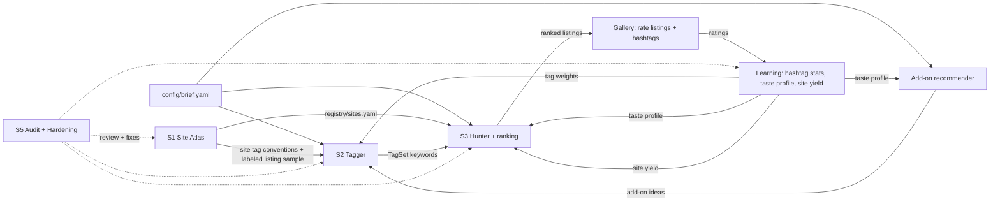

# Roadmap

This roadmap covers the build order, the session plan, the run loop and the shared contracts for the Costume shopping system.

Written in Session 0 on 2026-09-29. Each later session updates the section for its own system when it hands off.

## 1. Goal

The goal is a resale-shopping system that finds deep-cut items across a very wide range of sites. Tags generated from an item's **text and photo** steer the search. The system **learns the vibe and taste of the costume from ratings**, so every run searches and ranks better than the last.

Its first real job is the costume brief in `config/brief.yaml`:

| | |
|---|---|
| Character | Patrick Bateman, one-time costume |
| Already owned | Suit, tie |
| Need | Briefcase, fake axe, fake blood |
| Also wanted | Recommendations for add-ons that would make the costume look tough |
| Budget | **$75 total, shipping and tax included** |
| Briefcase | Must look like a regular full-size briefcase or attaché, not a mini. Must hold 12 oz cans or longneck bottles plus 1–2 bags of ice. |
| Buy by | **2026-10-15** (the event is 2026-10-31) |

### Two phases

1. **Build (S1–S5).** Each system gets one full session whose only job is to build it.
2. **Run (20–30 full runs).** The finished system runs end to end 20–30 times before the buy-by date. Each run finds listings, the user rates them, and the system learns from those ratings. §6 describes the loop.

## 2. The systems

| ID | Session | System | Job | What it must learn across runs |
|---|---|---|---|---|
| A | S1 | **Site Atlas** | Find and profile a massive, deep list of shopping sites. Used, resale, vintage, auction and estate sites come first, going far beyond Etsy, Depop and eBay. | Which sites actually produce liked finds (per-site yield). |
| B | S2 | **Tagger** | Take an item (text and/or photo) and produce the hashtags and keywords that find it and things like it. Includes site-specific variants. | Which hashtags find good listings and match the user's taste. It keeps the winners, drops the duds and keeps exploring new tags. |
| C | S3 | **Hunter** | Search the Atlas with the Tagger's keywords. Collect, normalize, filter against the brief, dedupe and **rank** the listings. | How to rank for the user's taste and the costume's vibe, beyond price and fit. |
| D | S4 | **Integration** | Combine A, B and C into one run loop. Build a gallery for rating **listings and hashtags**, a **hashtag popularity board**, the **taste profile**, and the **add-on recommender**. | Everything above. D is where the learning happens. |
| E | S5 | **Audit & Hardening** | Double-check the whole system, look for holes, fix the worst ones and improve the rest. It also proves the learning loop actually improves results. | Nothing; E verifies the rest. |

The Tagger is the foundation: its tags curate and guide the Hunter. Ranking and hashtag creation are the two places that have to be most advanced, because they are what lets the system get better with each run.

## 3. How the pieces connect

Items G, L and R are built in S4.

## 4. Build order

### Options considered

1. **A → B → C** (the order the user proposed): sites, then tags, then shopping.
2. **B → A → C**: tags first, because everything else depends on them.
3. **Thin C first**: a rough end-to-end shopper, then deepen each part.

| Criterion | A → B → C | B → A → C | Thin C first |
|---|---|---|---|
| Matches dependencies | Yes. A needs nothing upstream. | Partly. B can't measure itself without sites to search. | No. It builds on parts that don't exist yet. |
| Retires the biggest risk early | Yes. It finds out early which sites can actually be searched from here. | No. Access risk surfaces late, in S3. | Partly, but only for a handful of sites. |
| Gives B real evaluation data | Yes. A can harvest real listings (photo, seller title, seller tags) as ground truth. | No. B would have to invent an eval set and probably redo it. | No. |
| Time to first result | Slower | Slower | Fastest |
| Rework risk | Low | Medium | High. It locks in naive keywords and a few obvious sites, which is what A and B exist to beat. |

### Recommendation: A → B → C → D → E

The order the user proposed is right, with two additions to S1:

- **S1 also records how each site can be searched from this environment.** Most retailer hosts are blocked from the container (§11). If many sites can only be reached through a search-engine index, or not at all, the Hunter's design changes. That is better learned in S1 than discovered in S3.
- **S1 also harvests a labeled listing sample** (photo, seller title, seller tags or attributes, site) across the needed item types. That becomes S2's ground truth. The best test of a tag is **downstream yield**: does it find relevant listings? Real listings are what make that measurable.

**Chaining rule:** each session ends by writing the next session's kickoff prompt in `docs/sessions/`, based on what it actually built and learned.

**If time gets tight:** S2's tool-and-prior-art sweep doesn't depend on S1's output, so it can start while S1 is still building.

## 5. Method Discovery: every session starts here

Every session, S1 through S5, is a full session of its own whose job is to build its system. Each one **opens with a workflow that works out the best way to build its part before building it.** Each session designs that workflow itself. The minimum bar:

- **Frame.** Inputs, outputs, constraints, definition of done and a timebox.
- **Sweep.** Look at tools, services, APIs, MCP servers and connectors, models and datasets, and at prior art: how other people have solved this. Check whether each option is actually reachable from this environment.
- **Candidates.** Come up with at least two genuinely different methods, one of them a cheap baseline.
- **Bake-off.** Run the candidates on the same inputs. Write the scoring rule down *before* looking at results.
- **Challenge.** Actively look for holes in the winning method.
- **Decide.** Write a decision record in `docs/decisions/`.
- **Build, verify, hand off.**

Keep the working record in `research/<session>/method-discovery.md` (template: `docs/templates/method-discovery.md`).

Every system is built to be **run 20–30 times**. Design for repeat runs from the start: run logs, stable IDs, idempotent steps, and a cost per run that fits the calendar.

## 6. The run loop (20–30 runs)

Each run goes end to end and leaves the system smarter than it found it.

1. **Ideas.** The core items from the brief, plus add-on ideas from the recommender, plus liked listings to find more of.
2. **Tags.** The Tagger generates hashtags and keywords from text and photos. It is weighted by what earlier ratings liked, and it keeps a share of new tags in play to explore.
3. **Hunt.** The Hunter searches the Atlas, prioritizing sites with proven yield, then filters by the brief and landed price.
4. **Rank.** Results are ordered by a blend of fit to the brief, landed price, taste and vibe match, deep-cut value and freshness.
5. **Rate.** In the gallery, the user rates listings (stars) and hashtags (up or down) in a tap or two.
6. **Learn.** Ratings update four things:
   - **Hashtag stats.** For every tag: how often it was used, listings found, relevant finds, average rating of its listings, like rate, and trend across runs.
   - **Taste profile.** A learned model of the costume's vibe from what was liked and disliked, covering images as well as text. It includes a short plain-English "vibe summary" that is refreshed every run.
   - **Site yield.** Liked finds per site.
   - **Recommender state.** Which add-on ideas land.
7. **Report.** A run log with metrics, compared against earlier runs.

**The hashtag popularity board** shows which hashtags are popular: by the user's ratings, by how many good listings they find, and by trend (rising or falling). It is what makes the search better each run, and the user can see it and steer it.

**The add-on recommender** suggests items that would make the costume look tough, such as iconic details from the film and accessories that fit the learned vibe. Each suggestion shows its cost against the budget left after the core items. It flags anything that would push the total over $75 and never adds it to the kit on its own.

**Run metrics** should trend upward across runs. S5 checks that they actually do:
- like rate of the top 10 listings
- new relevant finds per run
- tag hit rate
- share of finds from deep-cut sites
- cost per run

**Open for Method Discovery:** how the taste profile and ranking actually learn. The options include weighted tag priors, image embeddings of liked listings, learning to rank from pairwise preferences, bandits for choosing tags and sites, and using Claude as a judge of the vibe summary. These are hypotheses for S2, S3 and S4 to test, not decisions.

## 7. Agents

Sessions can and should create their own agents (in `.claude/agents/`) whenever doing so would make the system better.

## 8. Session briefs

### S1: Site Atlas (Sep 30)

- **Job:** build a massive, deep list of places to shop. Used, resale, vintage, auction and estate sites come first. Go well past the obvious (Etsy, Depop, eBay) into niche, regional, app-first, auction, estate-sale, liquidation, international-proxy and specialty sites.
- **Starter segments** (a floor, not a limit): general marketplaces, fashion resale, vintage and antique, auctions and estate sales, online thrift, liquidation and returns, local classifieds, international and proxy buying, costume, prop and Halloween, luggage and office, deal aggregators.
- **Questions for Method Discovery:**
  - How do people find obscure resale sites?
  - Which directories, lists and communities catalogue marketplaces?
  - How can we tell a live site from a dead one?
  - How can searchability be tested at scale without breaking anyone's terms?
  - How should the list keep growing, and track per-site yield, across 20–30 runs?
- **Outputs:**
  - `registry/sites.yaml`, validated against `schemas/site.schema.json` (S1 owns this schema and may revise it).
  - An access result for every site.
  - Tag conventions per site.
  - The labeled listing sample for S2.
  - A rerunnable workflow, so the Atlas can be refreshed later.
  - A decision record, a handoff note and the S2 kickoff.
- **Done when:**
  - At least 150 live sites are in the registry (S1 sets the real target).
  - Every site has been probed.
  - The sample covers briefcases, axes and blood, with photos.
  - All tests pass.

### S2: Tagger (Oct 1)

- **Job:** take an item as text, a photo or both, and produce ranked hashtags and keywords that find it and similar items on resale sites. This includes site-specific forms such as marketplace tags, hashtags and item attributes. It has to use the **picture**, not just the words.
- **It must be advanced and it must learn.** Tags get stable IDs so ratings can roll up per tag. Generation takes feedback in: it favors tags with strong stats, retires dead ones, mines new tags from liked listings, and keeps an exploration share.
- **Hypotheses to test** (not decisions):
  - a multimodal LLM reading the photo directly
  - CLIP-family zero-shot tagging (e.g. FashionCLIP, SigLIP) against a tag vocabulary
  - reverse image search
  - marketplace autocomplete and suggest endpoints
  - mining tags from similar listings
  - hybrids of the above
- **Primary metric:** downstream search yield, meaning how many relevant listings the tags find.
- **Secondary metrics:** agreement with seller tags, deep-cut potential (rare but relevant terms), cost and latency.
- **Outputs:**
  - The `ItemInput`, `TagSet` and `TagStats` contracts.
  - The tagger tool.
  - Eval results.
  - A decision record, a handoff note and the S3 kickoff.

### S3: Hunter (Oct 2)

- **Job:** take keywords from the Tagger, plus the brief, and search the Atlas broadly. Collect listings, then:
  - normalize each one to a **landed price** (item + shipping + tax);
  - filter against the brief (briefcase size, budget, item type);
  - dedupe across sites;
  - rank the results.
- **Ranking must be advanced.** It blends fit, landed price, taste and vibe match, deep-cut value and freshness. It takes a taste profile and site yield as inputs, so it improves as ratings come in, and it starts sensibly before any ratings exist.
- **Questions for Method Discovery:**
  - What's the best way to query hundreds of sites that each have a different access method?
  - How do we pull dimensions and shipping out of messy listings?
  - Which ranking approach learns fastest from a few dozen ratings?
  - How should blocked or flaky sites be handled?
- **Outputs:**
  - The `SearchQuery`, `Listing` and `TasteProfile` contracts.
  - The hunter tool and the ranker.
  - A run log format.
  - A decision record, a handoff note and the S4 kickoff.

### S4: Integration (Oct 3)

- **Job:** combine everything into the run loop from §6. It builds:
  - **the gallery**, with a picture, link and landed price for every find, plus the **rating system** for listings (stars) and hashtags (up or down);
  - **the hashtag popularity board**;
  - **the learning step** that updates tag stats, the taste profile and site yield after every run;
  - **the add-on recommender**;
  - **one command for a full run**, repeatable 20–30 times;
  - **a "decide" mode** that picks the final kit, with order links, on the buy-by date.
- **Questions for Method Discovery:**
  - How should images get into the gallery? (§11 explains why this is hard.)
  - Where should ratings and stats live so both the gallery and the pipeline can read them?
  - How can the system learn well from a small number of ratings?

### S5: Audit & Hardening (Oct 4)

- **Job:** double-check the whole system, look for holes and make it better. That covers:
  - an end-to-end dry run on the real brief;
  - a hostile review of each stage;
  - coverage gaps in the Atlas;
  - failure modes (blocked sites, bad photos, foreign currency, sold-out listings);
  - cost per run against the 20–30-run plan;
  - contract drift.
- **Prove the learning loop works.** Replay simulated or real ratings and check that ranking and tag choice improve over a no-learning baseline. Check it doesn't collapse into a filter bubble.
- Fix the worst issues and leave a ranked backlog for the rest.

## 9. Calendar

| Dates | Work |
|---|---|
| Sep 29 | S0: roadmap and scaffold (this session) |
| Sep 30 | S1: Site Atlas |
| Oct 1 | S2: Tagger |
| Oct 2 | S3: Hunter |
| Oct 3 | S4: Integration |
| Oct 4 | S5: Audit & Hardening |
| Oct 5–14 | **20–30 full runs** (2–3 a day), rating each run in the gallery |
| **Oct 15** | **Buy** |
| Oct 31 | Event |

Each build session is budgeted at one day so the runs get ten days. If a build session slips, the number of runs drops; about 15 runs is the useful minimum.

**Plan B:** if the pipeline isn't producing good finds by Oct 12, buy the best candidates found so far so shipping still arrives in time.

## 10. Contracts

| Contract | Where | Owner | Status |
|---|---|---|---|
| Brief | `config/brief.yaml`, `schemas/brief.schema.json` | S0 | v3 |
| SiteRecord | `schemas/site.schema.json` | S1 | v0 draft |
| ItemInput, TagSet, TagStats | to be written | S2 | sketch |
| SearchQuery, Listing, TasteProfile | to be written | S3 | sketch |
| Rating, RunLog, Recommendation | to be written | S4 | sketch |

Sketches (starting points only; each owner defines the real thing):

- **ItemInput:** `id`, `text`, `images[]`, `category`, `brief_item` (briefcase, axe, blood or add-on), `source_url`.
- **TagSet:** `item_id`, `tags[]`, plus `per_site` variants and `negative` terms. Each tag has:
  - `tag_id` (stable) and `term`
  - `score`
  - `evidence`: text, image or both
  - `kind`: object, attribute, style, era, brand, material, color or vibe
  - `origin`: generated, mined, explore or user
- **TagStats:** `tag_id`, `uses`, `listings_found`, `relevant_found`, `avg_rating`, `like_rate`, `user_votes`, `trend`, `last_run`.
- **SearchQuery:** `site_id`, `query`, `filters`, `tag_ids[]`, `run_id`, `issued_at`.
- **Listing:** `id`, `site_id`, `url`, `title`, `images[]`, `price`, `shipping`, `landed_price`, `condition`, `dimensions`, `seller_tags[]`, `tag_ids[]` (which of our tags found it), `rank_score` with its parts, `run_id`, `found_at`.
- **TasteProfile:** `version`, `vibe_summary`, `tag_weights`, `image_centroids` (liked and disliked), `site_weights`, `updated_after_run`.
- **Rating:** `target` (a listing or a tag), `target_id`, `stars` (1–5) or `vote` (+1/-1), `note`, `run_id`, `rated_at`.
- **RunLog:** `run_id`, `started_at`, `inputs`, `queries`, `listings`, `metrics`, `cost`, `errors`.
- **Recommendation:** `id`, `item`, `why`, `est_cost`, `fits_budget`, `status` (suggested, liked, dismissed).

Validate any file against a schema with `uv run costume-validate <file> <schema> [--def Name] [--each]`.

## 11. Environment facts (verified 2026-09-29)

- **Retailer hosts are blocked.** The container's egress proxy returns 403 for retailer sites and their image CDNs (tested: amazon.com, `m.media-amazon.com`, `i.ebayimg.com`, `i5.walmartimages.com`, `i.etsystatic.com`).
- **Web access goes through connectors.** Use the **Firecrawl** connector for search and scrape, plus WebSearch/WebFetch. Firecrawl searches also listed Alexandria data providers for eBay, Amazon, Etsy and Target. Whether those providers actually run from here is untested.
- **Package registries work.** PyPI and npm are reachable, as is `storage.googleapis.com`.
- **Artifact pages can't hotlink images.** They block external images, so product photos have to be uploaded to the artifact. The container can only download them if the user adds the image hosts to the environment's allowed domains. The fallback is Firecrawl page screenshots.
- **Python setup.** Python 3.11 and uv are installed. The SessionStart hook runs `uv sync`.

## 12. Risks

| Risk | Impact | Mitigation |
|---|---|---|
| Bot walls and login walls (e.g. DataDome, logged-in-only marketplaces, app-only sellers) | Big sites can't be searched directly | Record them as blockers and never bypass them. Fall back to search-engine indexes, or skip. |
| Blocked hosts and images | No photos in the Tagger or the gallery | Ask the user to allowlist image hosts; use Firecrawl screenshots as the fallback. |
| Cold start (no ratings in the first runs) | Early ranking is generic | Seed from the brief and the vibe of the film. Let the user rate hashtags directly so learning starts on run 1. |
| Feedback loop narrows too fast | The system stops finding deep cuts | Keep a fixed exploration share of new tags and sites on every run. S5 tests for this. |
| Rating fatigue over 20–30 runs | Too few ratings to learn from | One-tap ratings, a small top-N per run, and hashtag votes in bulk. |
| Cost of 20–30 runs, plus Firecrawl usage limits | Runs stall or get expensive | Set a per-run tool-call budget in S4. S5 measures real cost. Consider a Firecrawl API key. |
| Over-building eats the calendar | Fewer than about 15 runs | One-day build sessions that stop at their definition of done. Plan B from Oct 12. |
| Resale shipping on bulky cases ($10–20+) | Blows the $75 cap | Rank by landed price, never by sticker price. |
| Stale or sold-out listings | Wasted picks | Re-check that a listing is still live before recommending it. |

## 13. Open questions for the user

1. What state or ZIP code will you order to? This sets tax and shipping estimates, and local-pickup options.
2. Should the image hosts be added to the environment's allowed domains? That makes photos much more reliable.
3. Is a Firecrawl API key available for higher limits?
4. Should add-on recommendations have to fit inside the $75, or be shown as extras beyond it?
5. Should the system stay costume-specific, or be general enough for future shopping? This decides how general the Atlas and the Tagger should be.
