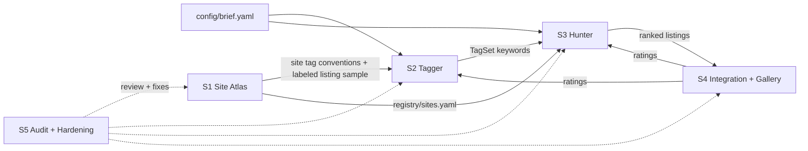

# Roadmap

This roadmap covers the build order, the session plan and the shared contracts for the Costume shopping system.

Written in Session 0, 2026-09-29. Each later session updates the section for its own system when it hands off.

## 1. Goal

The goal is a resale-shopping system that finds deep-cut items across a very wide range of sites. Tags generated from an item's **text and photo** steer the search.

Its first real job is the costume brief in `config/brief.yaml`:

| | |
|---|---|
| Character | Patrick Bateman, one-time costume |
| Already owned | Suit, tie |
| Need | Briefcase, fake axe, fake blood |
| Budget | **$75 total, shipping and tax included** |
| Briefcase | Must look like a regular full-size briefcase or attaché, not a mini. Must hold 12 oz cans or longneck bottles plus 1–2 bags of ice. |
| Buy by | **2026-10-15** (the event is 2026-10-31) |

## 2. The systems

| ID | Session | System | Job | Main output |
|---|---|---|---|---|
| A | S1 | **Site Atlas** | Find and profile a massive, deep list of shopping sites. Used, resale, vintage, auction and estate sites come first, going far beyond Etsy, Depop and eBay. | `registry/sites.yaml` |
| B | S2 | **Tagger** | Take an item (text and/or photo) and produce the hashtags and keywords that find it and things like it. Includes site-specific variants. | TagSet |
| C | S3 | **Hunter** | Search the Atlas with the Tagger's keywords. Collect, normalize, filter against the brief, dedupe and rank the listings. | Listings |
| D | S4 | **Integration** | Combine A, B and C into one pipeline. Add a gallery with pictures, links and ratings. Feed the ratings back into B and C. | Working pipeline + gallery |
| E | S5 | **Audit & Hardening** | Double-check the whole system, look for holes, fix the worst ones and improve the rest. | Audit report + fixes |

The Tagger is the foundation: its tags curate and guide the Hunter.

## 3. How the pieces connect

## 4. Build order

### Options considered

1. **A → B → C** (the order the user proposed): sites, then tags, then shopping.
2. **B → A → C**: tags first, because everything else depends on them.
3. **Thin C first**: a rough end-to-end shopper, then deepen each part.

| Criterion | A → B → C | B → A → C | Thin C first |
|---|---|---|---|
| Matches dependencies | Yes. A needs nothing upstream. | Partly. B can't measure itself without sites to search. | No. It builds on parts that don't exist yet. |
| Retires the biggest risk early | Yes. It finds out early which sites can actually be searched from here. | No. Access risk surfaces late, in S3. | Partly, but only for a handful of sites. |
| Gives B real evaluation data | Yes. A can harvest real listings (photo, seller title, seller tags) as ground truth. | No. B would have to invent an eval set and probably redo it. | No. |
| Time to first result | Slower | Slower | Fastest |
| Rework risk | Low | Medium | High. It locks in naive keywords and a few obvious sites, which is what A and B exist to beat. |

### Recommendation: A → B → C → D → E

The order the user proposed is right, with two additions to S1:

- **S1 also records how each site can be searched from this environment.** Most retailer hosts are blocked from the container (see §10). If many sites can only be reached through a search-engine index, or not at all, the Hunter's design changes. That is better learned in S1 than discovered in S3.
- **S1 also harvests a labeled listing sample** (photo, seller title, seller tags or attributes, site) across the needed item types. That becomes S2's ground truth. The best test of a tag is **downstream yield**: does it find relevant listings? Real listings are what make that measurable.

**Chaining rule:** each session ends by writing the next session's kickoff prompt in `docs/sessions/`, based on what it actually built and learned.

**If time gets tight:** S2's tool-and-prior-art sweep doesn't depend on S1's output, so it can start while S1 is still building.

## 5. Method Discovery: every session starts here

Every session, S1 through S5, is a full session of its own. Each one **opens with a workflow that works out the best way to build its part before building it.** Each session designs that workflow itself. The minimum bar:

- **Frame.** Inputs, outputs, constraints, definition of done and a timebox.
- **Sweep.** Look at tools, services, APIs, MCP servers and connectors, models and datasets, and at prior art: how other people have solved this. Check whether each option is actually reachable from this environment.
- **Candidates.** Come up with at least two genuinely different methods, one of them a cheap baseline.
- **Bake-off.** Run the candidates on the same inputs. Write the scoring rule down *before* looking at results.
- **Challenge.** Actively look for holes in the winning method.
- **Decide.** Write a decision record in `docs/decisions/`.
- **Build, verify, hand off.**

Keep the working record in `research/<session>/method-discovery.md` (template: `docs/templates/method-discovery.md`).

## 6. Agents

Sessions can and should create their own agents (in `.claude/agents/`) whenever doing so would make the system better.

## 7. Session briefs

### S1: Site Atlas (Sep 30 – Oct 1)

- **Job:** build a massive, deep list of places to shop. Used, resale, vintage, auction and estate sites come first. Go well past the obvious (Etsy, Depop, eBay) into niche, regional, app-first, auction, estate-sale, liquidation, international-proxy and specialty sites.
- **Starter segments** (a floor, not a limit): general marketplaces, fashion resale, vintage and antique, auctions and estate sales, online thrift, liquidation and returns, local classifieds, international and proxy buying, costume, prop and Halloween, luggage and office, deal aggregators.
- **Questions for Method Discovery:**
  - How do people find obscure resale sites?
  - Which directories, lists and communities catalogue marketplaces?
  - How can we tell a live site from a dead one?
  - How can searchability be tested at scale without breaking anyone's terms?
  - How should the list keep growing after S1?
- **Outputs:**
  - `registry/sites.yaml`, validated against `schemas/site.schema.json` (S1 owns this schema and may revise it).
  - An access result for every site.
  - Tag conventions per site.
  - The labeled listing sample for S2.
  - A rerunnable workflow, so the Atlas can be refreshed later.
  - A decision record, a handoff note and the S2 kickoff.
- **Done when:**
  - At least 150 live sites are in the registry (S1 sets the real target).
  - Every site has been probed.
  - The sample covers briefcases, axes and blood, with photos.
  - All tests pass.

### S2: Tagger (Oct 2–3)

- **Job:** take an item as text, a photo or both, and produce ranked hashtags and keywords that find it and similar items on resale sites. This includes site-specific forms such as marketplace tags, hashtags and item attributes. It has to use the **picture**, not just the words.
- **Hypotheses to test** (not decisions):
  - a multimodal LLM reading the photo directly
  - CLIP-family zero-shot tagging (e.g. FashionCLIP, SigLIP) against a tag vocabulary
  - reverse image search
  - marketplace autocomplete and suggest endpoints
  - mining tags from similar listings
  - hybrids of the above
- **Primary metric:** downstream search yield, meaning how many relevant listings the tags find.
- **Secondary metrics:** agreement with seller tags, deep-cut potential (rare but relevant terms), cost and latency.
- **Outputs:**
  - The `ItemInput` and `TagSet` contracts.
  - The tagger tool.
  - Eval results.
  - A decision record, a handoff note and the S3 kickoff.

### S3: Hunter (Oct 4–5)

- **Job:** take keywords from the Tagger, plus the brief, and search the Atlas broadly. Collect listings, then:
  - normalize each one to a **landed price** (item + shipping + tax);
  - filter against the brief (briefcase size, budget, item type);
  - dedupe across sites;
  - rank the results.
- **Questions for Method Discovery:**
  - What's the best way to query hundreds of sites that each have a different access method?
  - How do we pull dimensions and shipping out of messy listings?
  - How should results be ranked?
  - How should blocked or flaky sites be handled?
- **Outputs:**
  - The `SearchQuery` and `Listing` contracts.
  - The hunter tool.
  - A run log format.
  - A decision record, a handoff note and the S4 kickoff.

### S4: Integration (Oct 6)

- **Job:** combine everything into one pipeline that runs item → tags → hunt → gallery. It adds:
  - a gallery artifact with a picture, link, landed price and a rating control for every find;
  - ratings that flow back into tag weights and ranking so the system learns the user's style;
  - one command for manual runs, a couple of times a day until Oct 15;
  - a "decide" mode that picks the final kit, with order links, on the buy-by date.
- **Questions for Method Discovery:**
  - How should images get into the gallery? (§10 explains why this is hard.)
  - Where should ratings live?
  - How should the system learn from a small number of ratings?

### S5: Audit & Hardening (Oct 7)

- **Job:** double-check the whole system, look for holes and make it better. That covers:
  - an end-to-end dry run on the real brief;
  - a hostile review of each stage;
  - coverage gaps in the Atlas;
  - failure modes (blocked sites, bad photos, foreign currency, sold-out listings);
  - cost per run;
  - contract drift.
- Fix the worst issues and leave a ranked backlog for the rest.

## 8. Calendar

| Dates | Work |
|---|---|
| Sep 29 | S0: roadmap and scaffold (this session) |
| Sep 30 – Oct 1 | S1: Site Atlas |
| Oct 2–3 | S2: Tagger |
| Oct 4–5 | S3: Hunter |
| Oct 6 | S4: Integration |
| Oct 7 | S5: Audit & Hardening |
| Oct 7–14 | Manual hunting runs, a couple per day, rating finds in the gallery |
| **Oct 15** | **Buy** |
| Oct 31 | Event |

**Plan B:** if the pipeline isn't producing good finds by Oct 12, buy the best candidates found so far so shipping still arrives in time.

## 9. Contracts

| Contract | Where | Owner | Status |
|---|---|---|---|
| Brief | `config/brief.yaml`, `schemas/brief.schema.json` | S0 | v2 |
| SiteRecord | `schemas/site.schema.json` | S1 | v0 draft |
| ItemInput | to be written | S2 | sketch |
| TagSet | to be written | S2 | sketch |
| SearchQuery, Listing | to be written | S3 | sketch |
| Rating | to be written | S4 | sketch |

Sketches (starting points only; each owner defines the real thing):

- **ItemInput:** `id`, `text`, `images[]`, `category`, `brief_item` (briefcase, axe or blood), `source_url`.
- **TagSet:** `item_id`, `tags[]` with `term`, `score`, `evidence` (text, image or both) and `kind` (object, attribute, style, era, brand, material, color), plus `per_site` variants and `negative` terms.
- **SearchQuery:** `site_id`, `query`, `filters`, `tagset_ref`, `issued_at`.
- **Listing:** `id`, `site_id`, `url`, `title`, `images[]`, `price`, `shipping`, `landed_price`, `condition`, `dimensions`, `seller_tags[]`, `found_by`, `found_at`.
- **Rating:** `listing_id`, `stars` (1–5), `note`, `rated_at`.

Validate any file against a schema with `uv run costume-validate <file> <schema> [--def Name] [--each]`.

## 10. Environment facts (verified 2026-09-29)

- **Retailer hosts are blocked.** The container's egress proxy returns 403 for retailer sites and their image CDNs (tested: amazon.com, `m.media-amazon.com`, `i.ebayimg.com`, `i5.walmartimages.com`, `i.etsystatic.com`).
- **Web access goes through connectors.** Use the **Firecrawl** connector for search and scrape, plus WebSearch/WebFetch. Firecrawl searches also listed Alexandria data providers for eBay, Amazon, Etsy and Target. Whether those providers actually run from here is untested.
- **Package registries work.** PyPI and npm are reachable, as is `storage.googleapis.com`.
- **Artifact pages can't hotlink images.** They block external images, so product photos have to be uploaded to the artifact. The container can only download them if the user adds the image hosts to the environment's allowed domains. The fallback is Firecrawl page screenshots.
- **Python setup.** Python 3.11 and uv are installed. The SessionStart hook runs `uv sync`.

## 11. Risks

| Risk | Impact | Mitigation |
|---|---|---|
| Bot walls and login walls (e.g. DataDome, logged-in-only marketplaces, app-only sellers) | Big sites can't be searched directly | Record them as blockers and never bypass them. Fall back to search-engine indexes, or skip. |
| Blocked hosts and images | No photos in the Tagger or the gallery | Ask the user to allowlist image hosts; use Firecrawl screenshots as the fallback. |
| Firecrawl usage limits | Research runs stall | Budget tool calls per run. Consider adding an API key. |
| Over-building eats the calendar | Nothing is ready to shop by Oct 7 | Timebox every session and stop at its definition of done. Plan B from Oct 12. |
| Resale shipping on bulky cases ($10–20+) | Blows the $75 cap | Rank by landed price, never by sticker price. |
| Stale or sold-out listings | Wasted picks | Re-check that a listing is still live before recommending it. |

## 12. Open questions for the user

1. What state or ZIP code will you order to? This sets tax and shipping estimates, and local-pickup options.
2. Should the image hosts be added to the environment's allowed domains? That makes photos much more reliable.
3. Is a Firecrawl API key available for higher limits?
4. Is the clear raincoat from the film in scope if the budget allows?
5. Should the system stay costume-specific, or be general enough for future shopping? This decides how general the Atlas and the Tagger should be.
